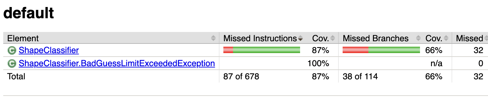

# ShapeClassifier
This is the repository to experiment with testing. You only need to test `evaluateGuess()` method

# Blackbox Testing

For this task we will create test cases from the ShapeClassifier specification. You should
refrain from looking at the code as a source for test cases. You will test this program by identifying
equivalence classes for inputs, encoding these partitions as an ACTS test specification (conditions
and constraints), and using ACTS to generate test inputs accordingly. For this question, your steps
are roughly as follows:

1. Identify equivalence classes and constraints for the ShapeClassifier inputs
2. Translate the equivalence classes generated in step A to test cases using weak equivalence class testings
3. Construct and execute JUnit test cases for each test case.

The ACTS tool can be accessed in the ACTS folder.

# Whitebox Testing

# Building and Testing with Maven

`mvn clean test`
